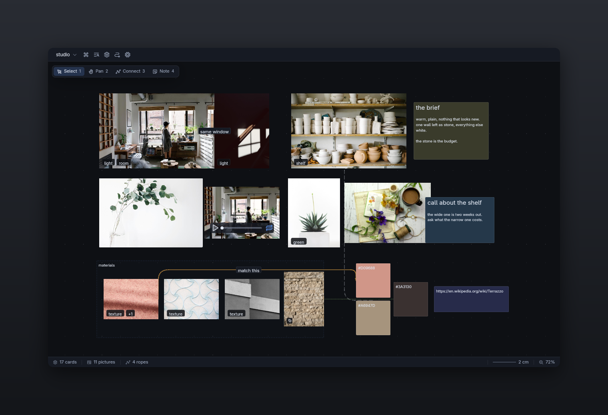
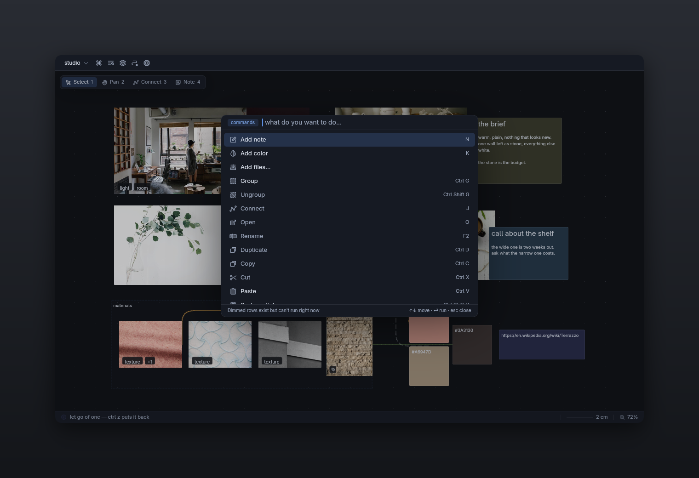
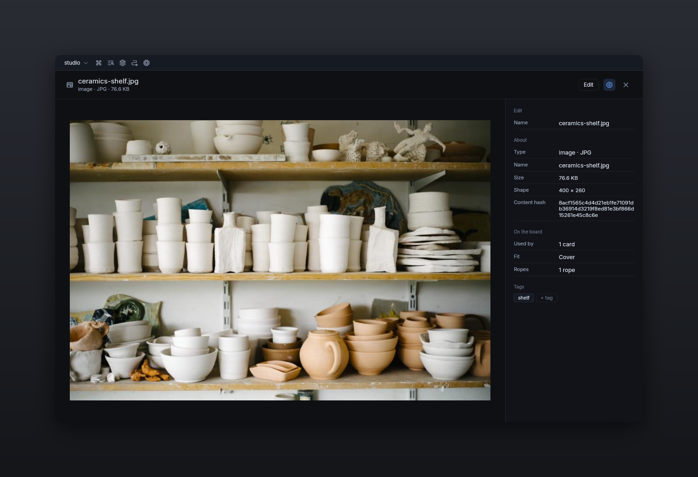
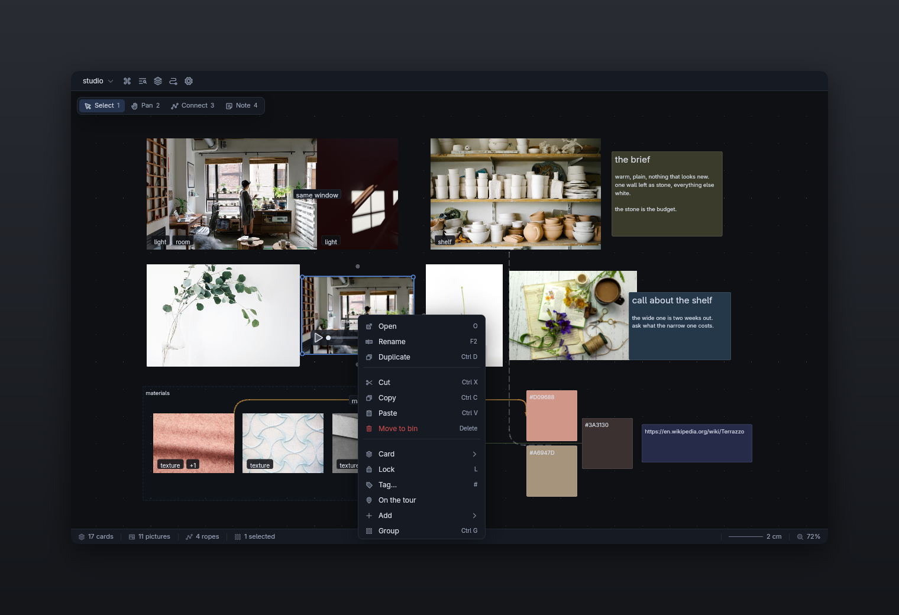
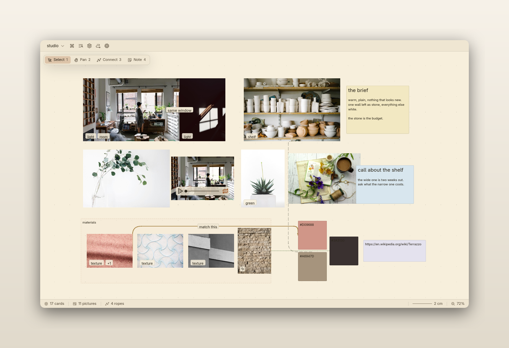
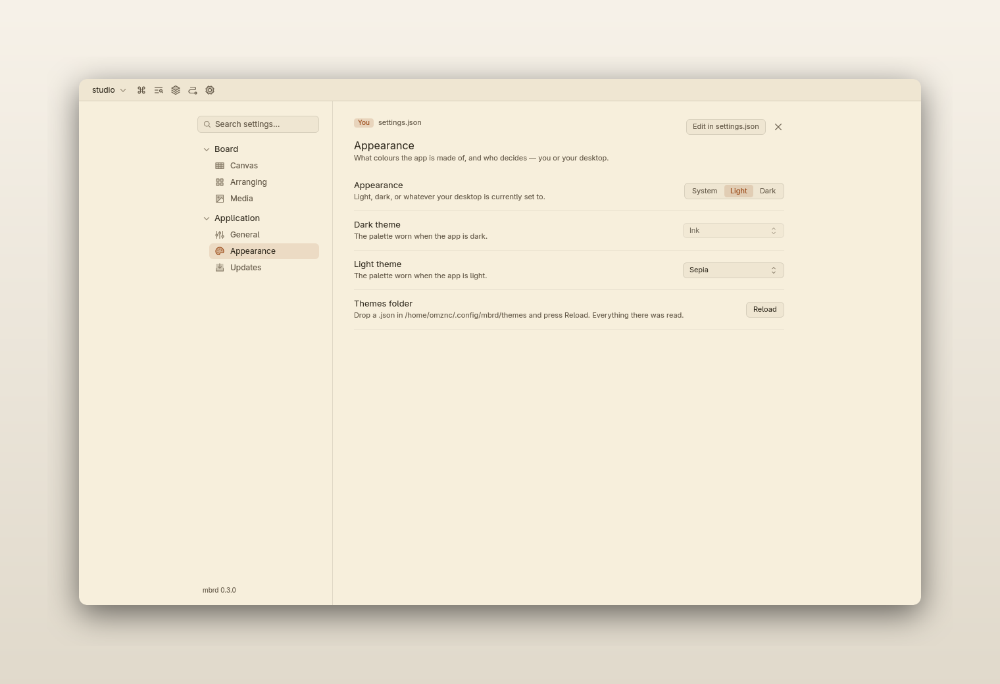

# mbrd

A moodboard on a canvas that goes on forever. Completely stolen from [Kosta's mbrd](https://mbrd.valjdakosta.com/), just made with native UI and reimplemented in rust.
Pan, zoom, drop images, notes and
connections onto a board with no edges, and it all lives in a single `.mbrd`
file that travels. Native, built on [GPUI](https://gpui.rs/).

[](docs/screenshots/board-dark.png)

| Everything, as a list you type at | A card, on the whole window | What applies to what you pressed |
|---|---|---|
| [](docs/screenshots/palette-dark.png) | [](docs/screenshots/opened-dark.png) | [](docs/screenshots/menu-dark.png) |

The board in those is [`studio.mbrd`](docs/screenshots/studio.mbrd), which is
in the repository — open it and you are looking at the screenshots. The rest
of them are in [`docs/screenshots`](docs/screenshots), which also says how they
are retaken.

## Run it

Grab a build from the [releases](https://github.com/omznc/mbrd-rs/releases), or:

```
cargo run -p mbrd                       # a demonstration board
cargo run -p mbrd -- some-board.mbrd    # a real one
```

Building from source on Linux needs a handful of system packages — see
[`CONTRIBUTING.md`](CONTRIBUTING.md).

## In a browser

[**mbrd.omarzunic.com**](https://mbrd.omarzunic.com) is the same application,
compiled to WebAssembly. Not a viewer and not a cut-down one: the same board
model, the same canvas, the same commands.

Boards live in the browser's own database, on the machine you opened it on —
there is no account and nothing is uploaded. A board you want to keep, or open
in the desktop app, comes out with **Download board**, which hands you the same
`.mbrd` file every other platform writes.

Video and audio play, out of the browser's own decoders. Anything a browser
will not open — Matroska, most `.avi` — says so on the card rather than
failing quietly, which is what a desktop without the right codec already does.

It needs WebGPU, which means Chrome, Edge, or Safari 26 — Firefox needs
`dom.webgpu.enabled`. Two things are missing rather than pretending: a pasted
link is not followed, and there is no updater, because reloading the page is
the update. The bar carries a button that hands you the desktop build for
whatever you are on instead.

```
scripts/build-web.sh            # into dist/, ready to serve
python3 -m http.server -d dist  # and look at it
```

## Themes

*Settings → Application → Appearance* — a light theme and a dark one, and
whether to follow your desktop or pin one. Drop a `.json` in your themes
folder for your own; [`THEMES.md`](THEMES.md) is every colour there is and
what it draws.

| The same board, light | Where that is chosen |
|---|---|
| [](docs/screenshots/board-light.png) | [](docs/screenshots/settings-light.png) |

## Controls

| | |
|---|---|
| drag empty space | pan around |
| wheel / `Shift` + wheel | zoom to the cursor / pan sideways |
| middle-drag | pan from anywhere, even over a card |
| click empty space | let go of the selection; `Ctrl`+`Z` puts it back |
| `Shift` or `Ctrl` + drag empty space | select several cards |
| drag a card | move it, and anything selected with it; smart guides line it up |
| `Shift` mid-drag | pins the move to one axis |
| `Alt` + drag a card | leaves a copy behind |
| drag a corner or an edge | resize; a picture keeps its proportions |
| `Ctrl` + drag a handle | resize a picture freely; `Shift` holds any card's shape |
| `Alt` + drag a handle | crop: the picture fills the card and the card cuts it |
| arrows | nudge; `Shift` moves a whole grid step |
| `0` / `F` | recenter / fit everything on screen |
| `Ctrl`+`A` / `Esc` / `Del` | select all / clear / delete — `Ctrl`+`Z` is the way back |
| right-click | everything else, next to what it acts on — the list shows what applies to whatever you pressed and leaves out what does not |
| double-click a card, or `O` | open it on the whole window — a document gets set as a page, a file gets its source, a picture gets contained, and everything gets an Edit button and an info rail |
| `F2` or `Enter` | type into a card without leaving the board |
| `N` / `K` / `E` | new note / new color / new fence |
| `T` | next tint, on a note |
| `#` | put a word on what is selected, off the list of words already on the board |
| `Ctrl`+`G` / `Ctrl`+`Shift`+`G` | group what is selected into a fence / dissolve it |
| double-click a card in a fence | steps inside, so presses reach what is in it; `Esc` steps back out |
| hover a card, drag a mark | pull a rope to another card |
| `J` | join what is selected, with the shortest set of ropes |
| double-click a rope, or `F2` | label it; right-click it for color, arrows, style |
| `L` | lock what is selected, or let it go — a locked card wears a padlock, refuses every drag and handle, and layouts go around it |
| `W` | show or hide the ropes |
| `1`–`4`, or `V` / `H` / `C` | select / pan / connect / note |
| `Ctrl`+`C` / `Ctrl`+`X` / `Ctrl`+`D` | copy / cut / duplicate |
| `[` / `]` | send to back / bring to front |
| `G` / `X` / `S` | grid / axes / snapping |
| drop a file or folder, or `Ctrl`+`V` | put it on the board |
| the View menu, or `Shift` `Shift` | show only what wears a tag, walk the board's tour, set the scale by drawing a line along something you know the size of, and see what the board is made of and what it weighs |
| `Ctrl`+`Z` / `Ctrl`+`Shift`+`Z` | undo / redo |
| `Ctrl`+`S` | save now, and say so — the board is written a second after every change without it |
| `Ctrl`+`N` | a new board, in `~/mbrd` |
| `Ctrl`+`P`, or the board's name top left | open another board |
| `Ctrl`+`F` / `Ctrl`+`K` | find something on the board, and go to it |
| `Shift` `Shift` | every command there is, as a list you type at |
| `Ctrl`+`U` | check for a new version, then install it |

## The file format

A `.mbrd` is a ZIP with a different extension — indented JSON, real Markdown
sidecars you can edit in place, assets deduped by content hash. It is
[specified](../mbrd/research/docs/mbrd-format.md) and explicitly free to
implement; this app is a second implementation of it.

```
myboard.mbrd
├── mimetype                    the media type, first and stored, at offset 38
├── manifest.json               what this file is
├── board.json                  the board itself
├── assets/<slug>--<hash>.<ext> embedded bytes, deduped by content hash
├── notes/<slug>--<id>.md       one note, as Markdown
└── waveforms/<hash>.json       one audio file's measured readings
```

## What is not here yet

The short version: no input method for composing keyboards, no rich text beyond
Markdown, no sticker shapes, no playlist for a board's audio, and rotation
round-trips but is not drawn. Sound and video play on all three platforms,
through the decoder the machine already has, so which formats work is the
machine's answer rather than mbrd's. [The issues](https://github.com/omznc/mbrd-rs/issues)
are what is left to build; [`CONTRIBUTING.md`](CONTRIBUTING.md) has what was cut
on purpose, and why.

## Contributing

Layout, invariants, tests, and the release process are in
[`CONTRIBUTING.md`](CONTRIBUTING.md).
